# 通用方法

#### 1. 角色四向移动
> 只需要三行代码搞定  
var direction = Input.get_vector("ui_left","ui_right","ui_up","ui_down")   
velocity = direction * SPEED    
move_and_slide()  

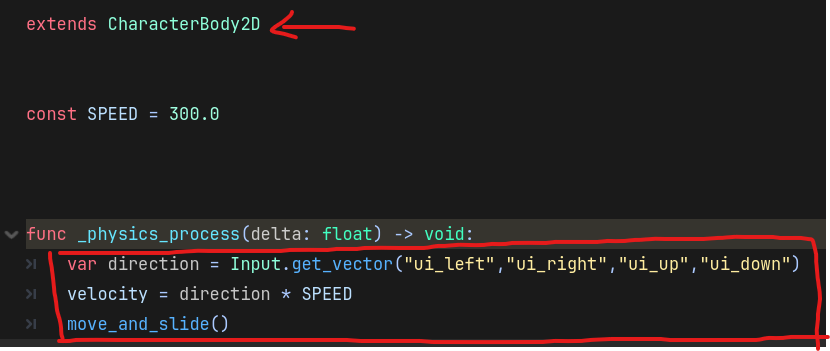

#### 2. Godot 如果节点未挂载脚本，则默认不运行 process与 physics process

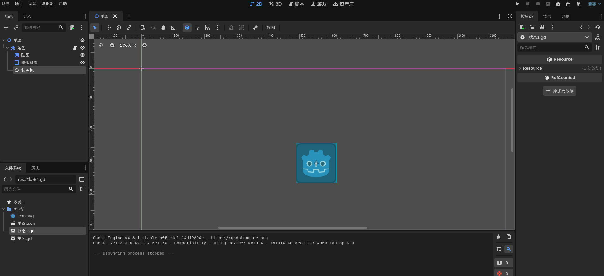
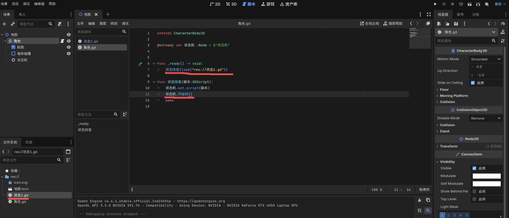
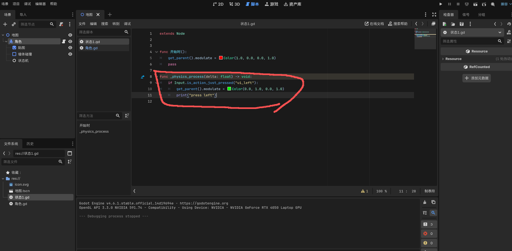
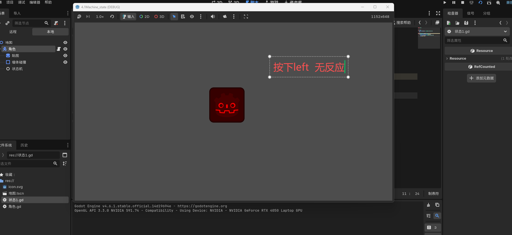
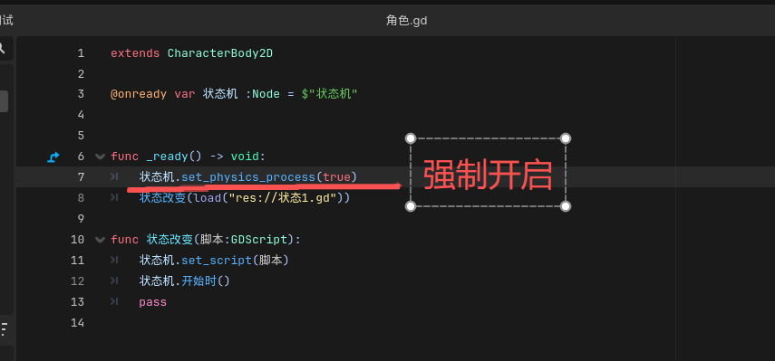
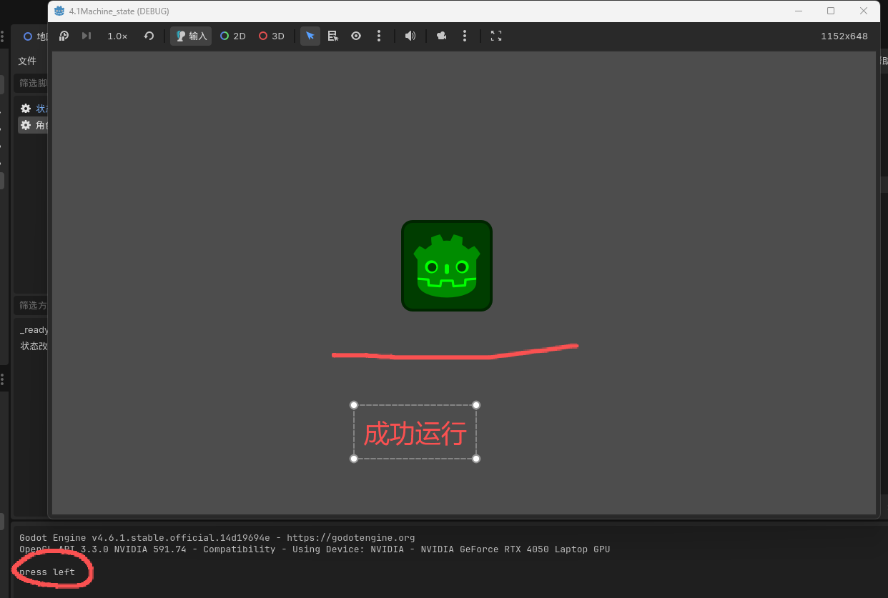  

#### 3. 全局单例-预加载
可以把需要缓存的预加载内容写到一个脚本中，在项目设置中设置为全局单例  
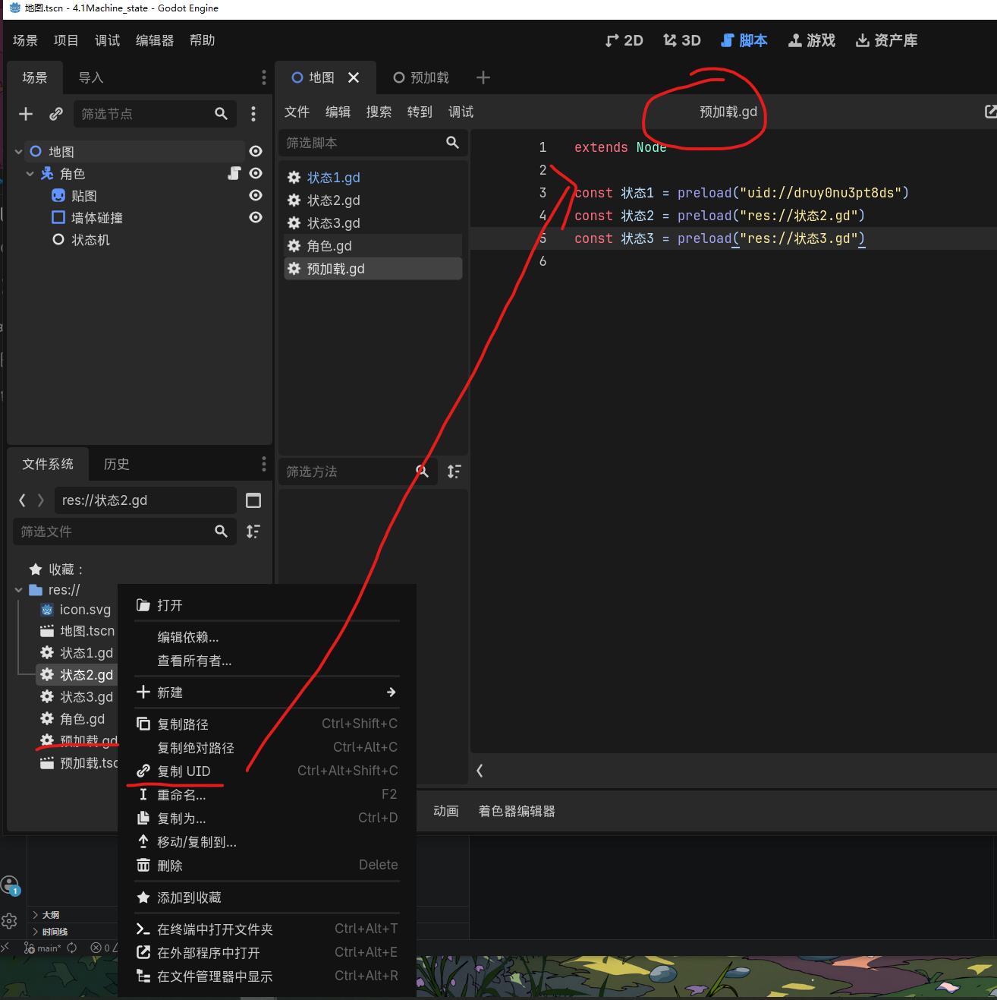
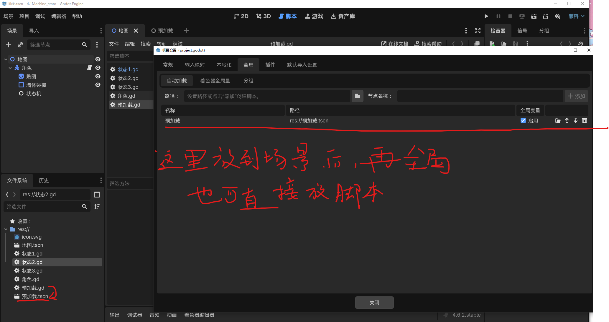
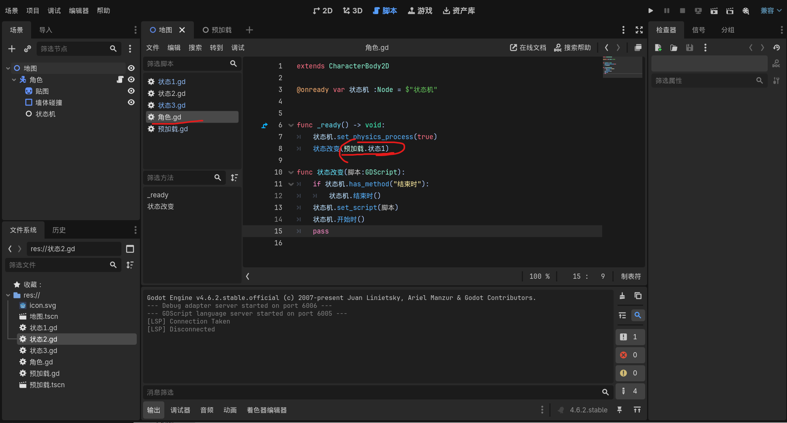

#### 4. 实例化的场景（子节点可编辑）
在右键选项中勾选 子节点 可编辑，即可展开实例化场景中的所有节点
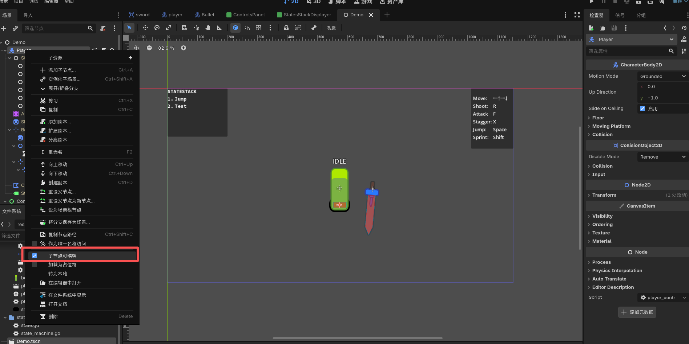

#### 5. 在节点中使用 % (唯一节点命名)
类似于全局标识ID，在其他地方访问，可以直接使用 %[名称]进行获取，而无需根据路径来查找节点
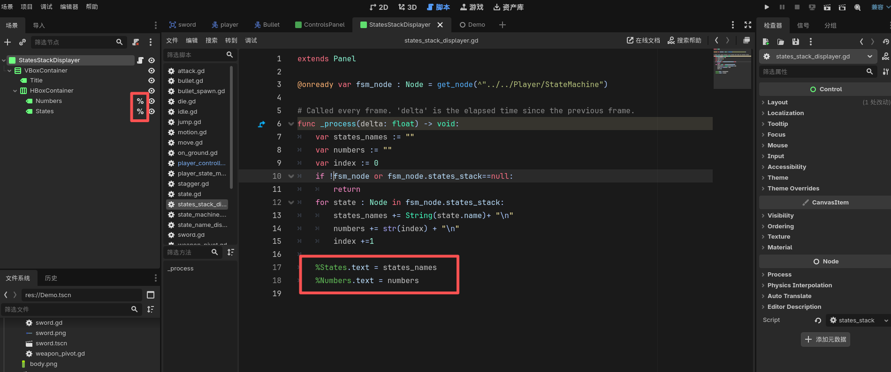