# World
瓦片地图、碰撞检测、碰撞隐藏（当在2D地图中，player进入房间时，墙壁虚化处理）
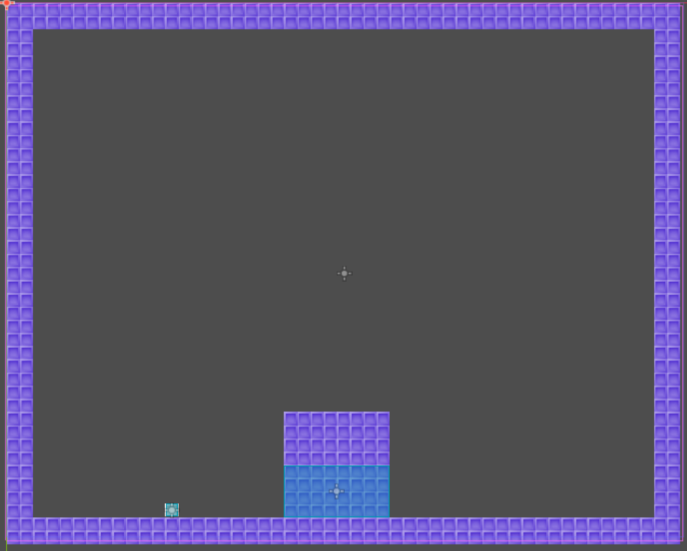

### 项目结构：
> - Node2D
>   - TileMapLayer
>   - TileMapLayer
>   - Camera2D
>   - CharacterBody2D
>   - Area2D
>      - CollisionShape2D

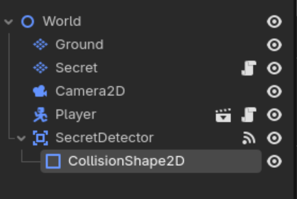

### 通用设置-项目设置
1. 设置默认重力   
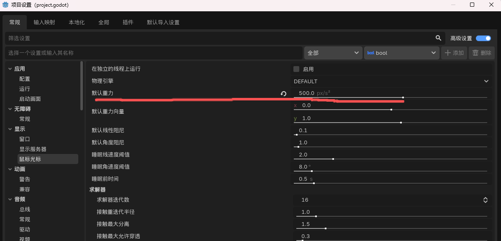  

2. 设置输入映射   
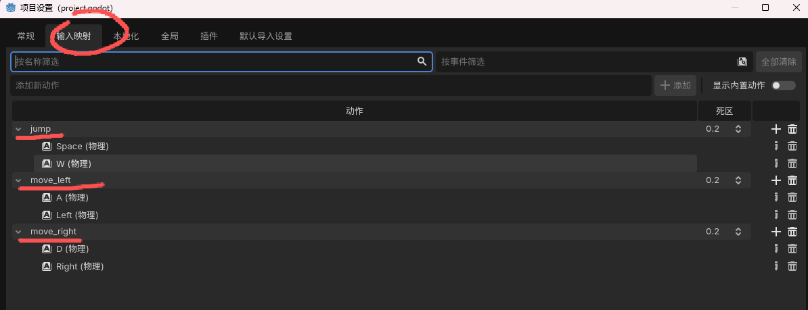  

3. 设置屏幕尺寸  
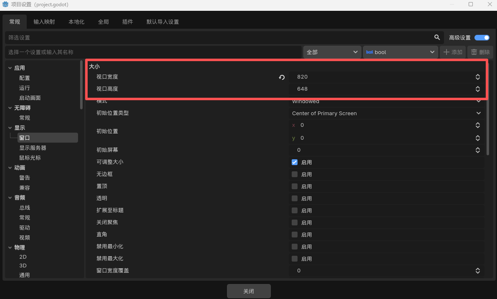  

#### 一、Player
player的结构  
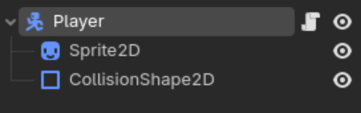

代码部分  
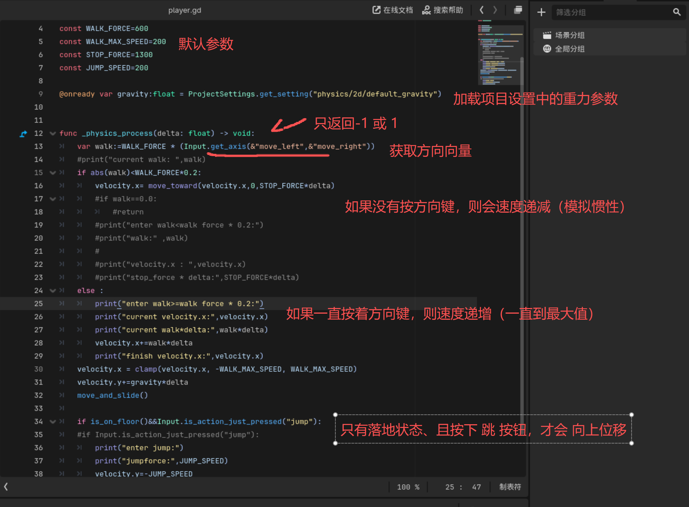

### 绘制瓦片地图

1. 使用TileMapLayer 绘制地图地图,并设置物理层  
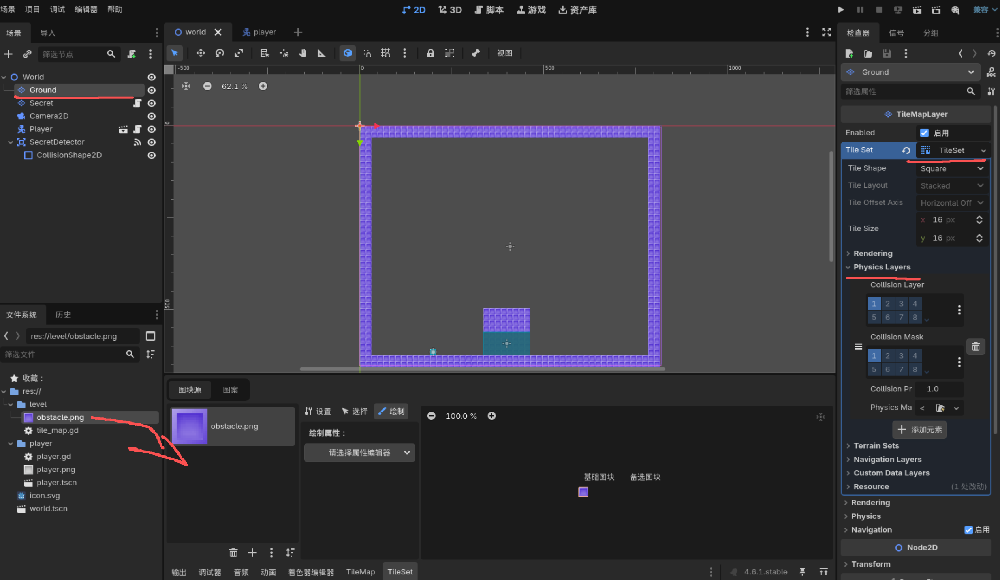

2. 使用TileMapLayer 绘制地图隐藏区  
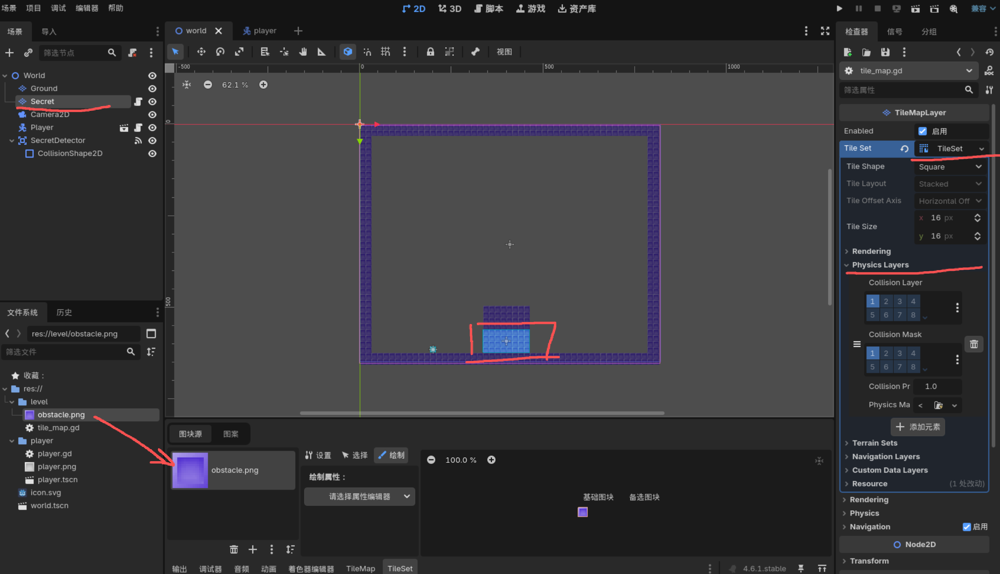

3. 给瓦片地图隐藏区域设置Area2D碰撞区域  
并设置物体进入/离开该区域的信号绑定到隐藏区域瓦片地图的挂载脚本中
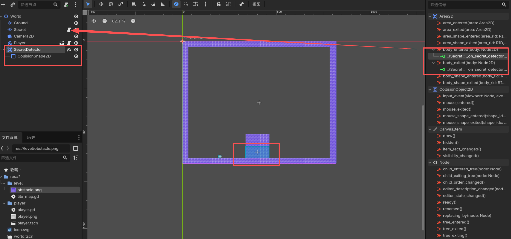

4. 针对隐藏区域使用代码进行特殊处理  
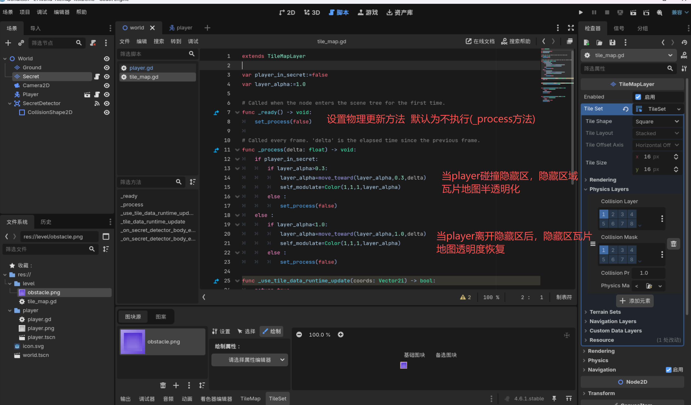
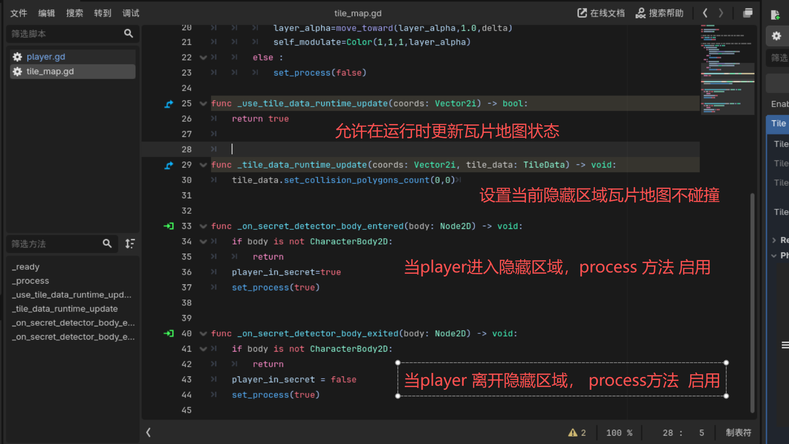

