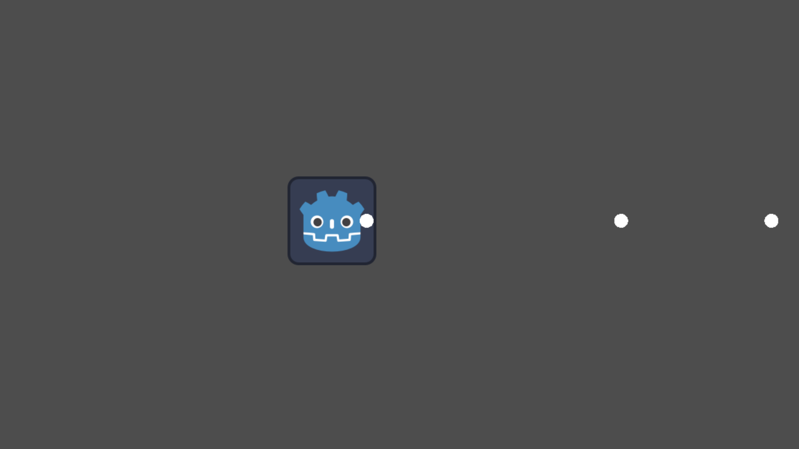
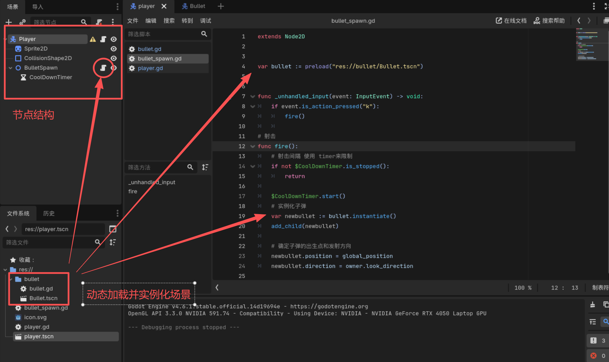
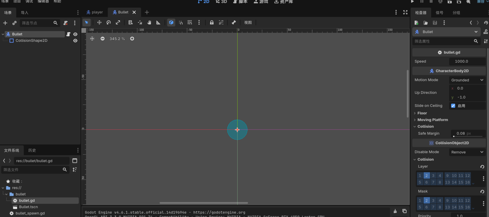
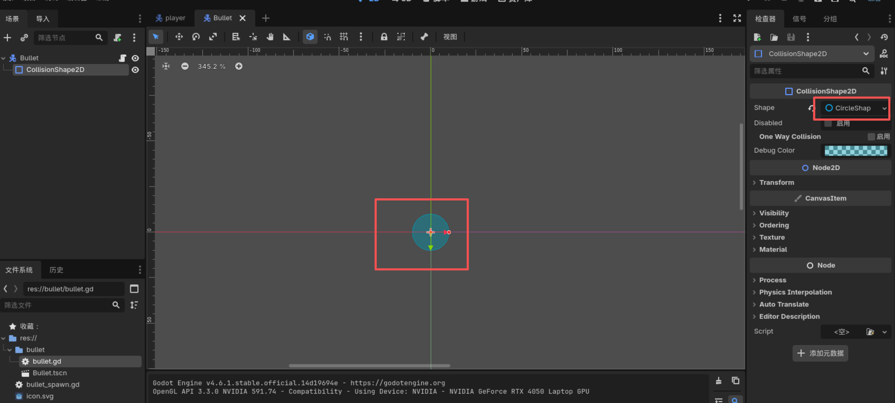
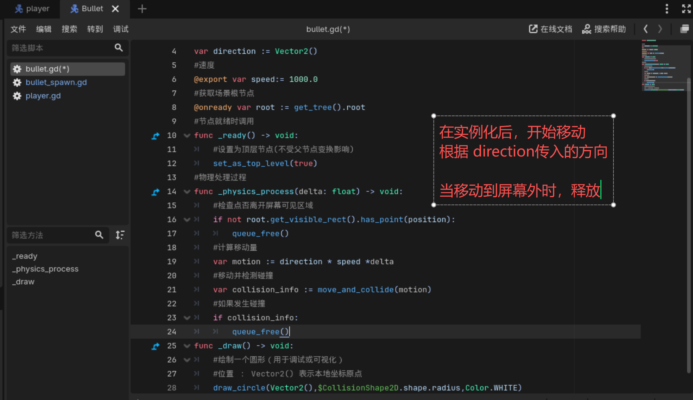
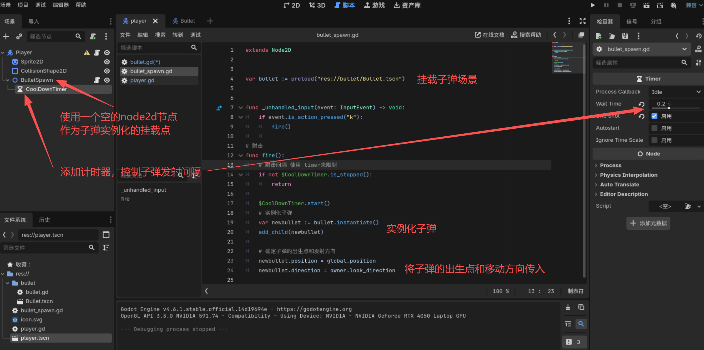
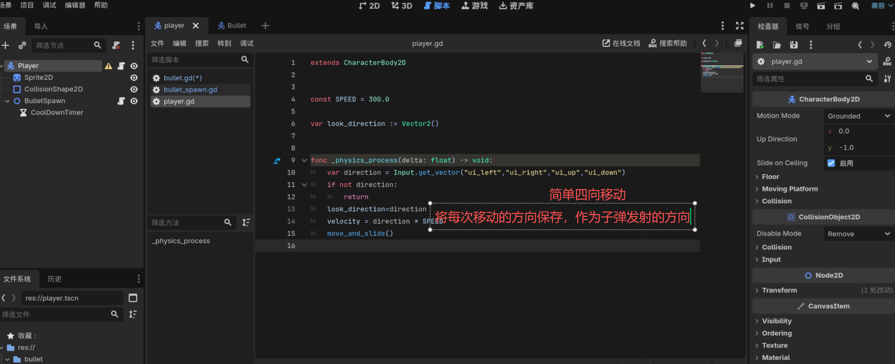

# Bullet 射击-子弹
  

设计类的子弹发射
#### 节点结构与主体设计
  

#### 子弹场景
1. 使用CharacterBody2D与 CollisionShape2D构造 子弹的基本结构  
  

2. CollisionShape2D根据实际情况确定子弹的形状（此处为圆形） 
    

3. 子弹的脚本处理
    

#### 在使用的场景中实例化子弹（当前为player）
1. 挂载节点并实例化子弹
  

2. 精灵的简单移动
  