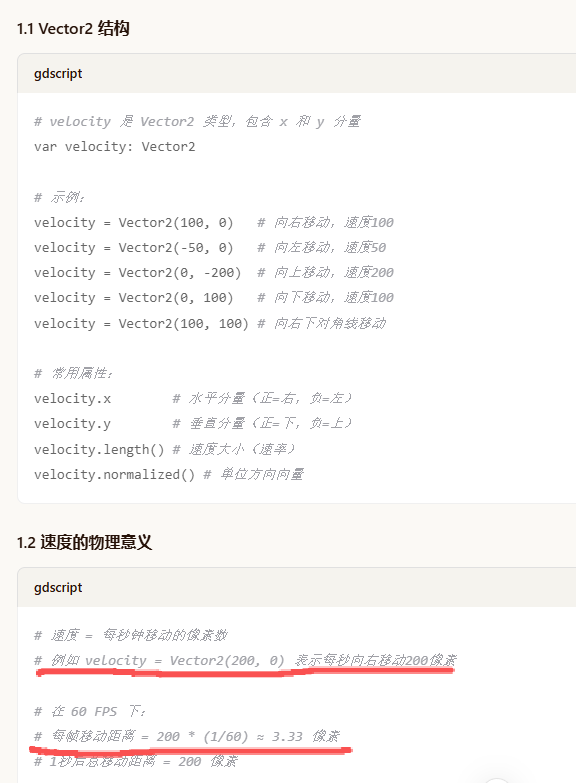
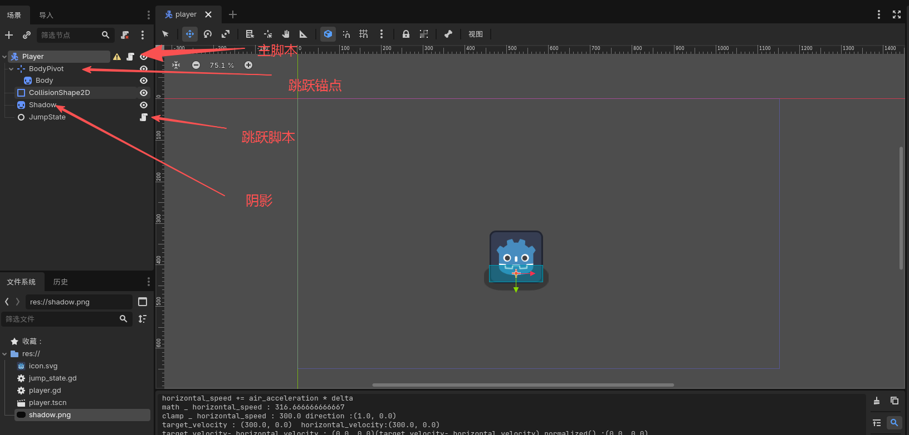
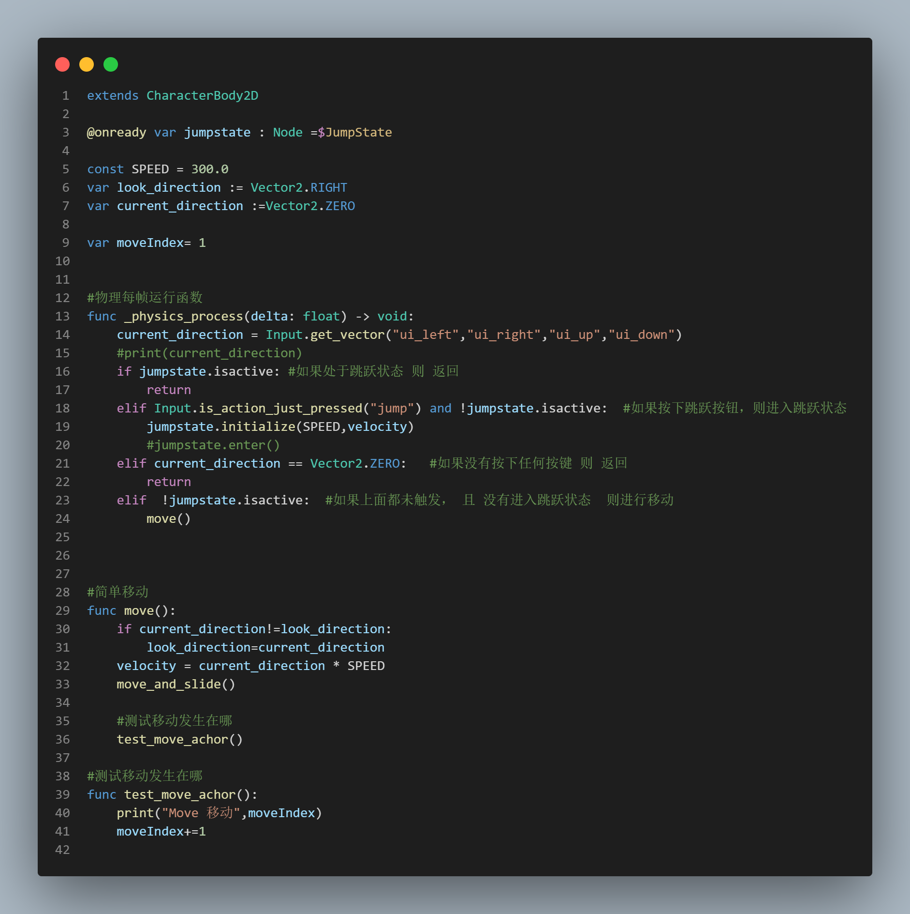
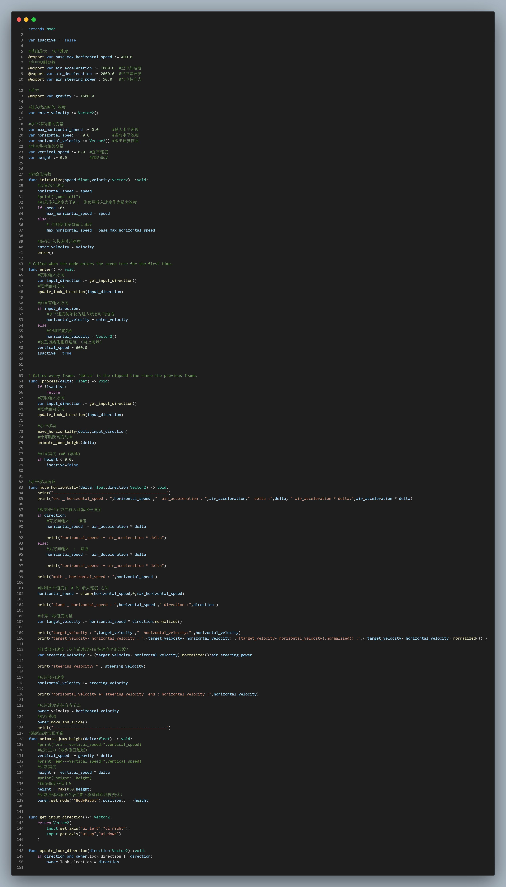
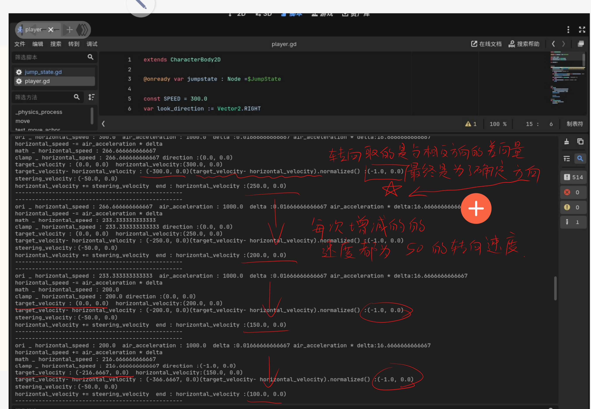

# 速度平滑过渡

## 一、在Godot 中 Velocity 的 详解
在 Godot 2D 中，velocity是一个 Vector2​ 类型的变量，表示物体在二维平面上的移动速度和方向。
 

## 二、项目结构
 

## 三、脚本
### 3-1. Player 脚本
在代码中，将跳跃与其他状态的 physics_process 分离
 

### 3-2. 跳跃状态 脚本
 

平滑过渡的真实内在逻辑
 
