# finite state machine 持久状态机
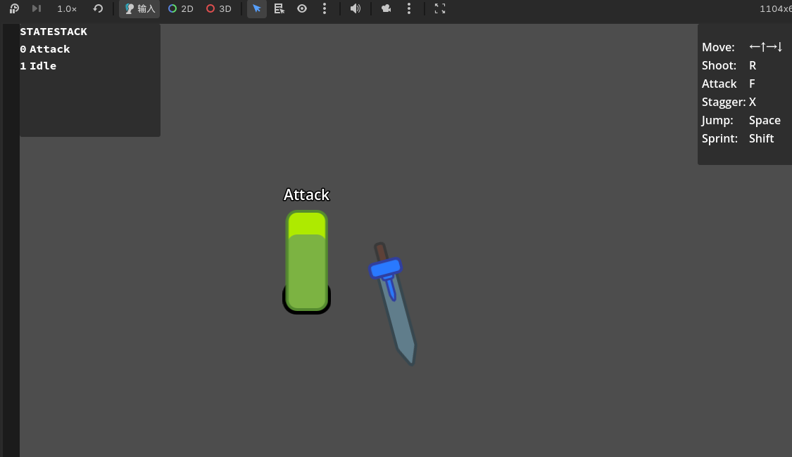  
## 0、项目中的一些通用方法
#### 改变轴心点
快捷键是V   
但是有些节点无法改变轴心点（因为它只是一个空的，作为挂载节点，比如Area2D）  
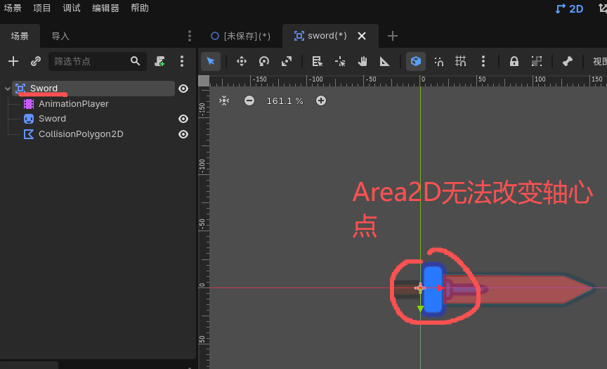  
所以，可以通过移动 子节点  的方式，来改变旋转的轴心点  
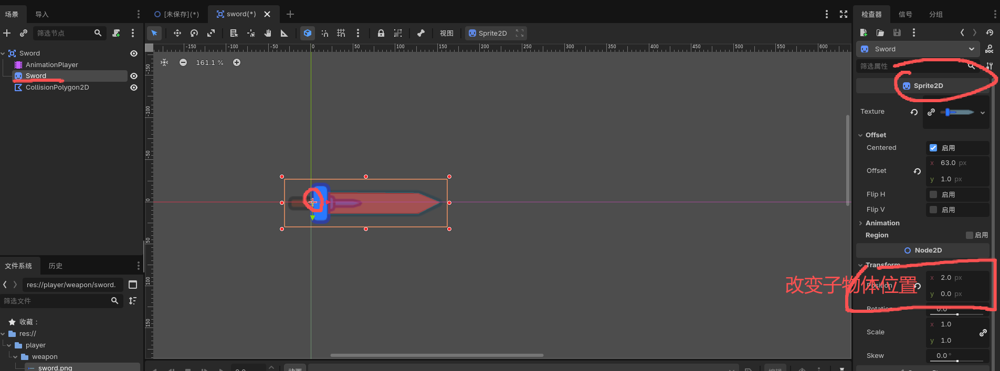  

#### 使用其他脚本（未在节点中挂载）
使用 extend "路径/xxx.gd" 来拓展其他脚本  
类似于C# 的继承
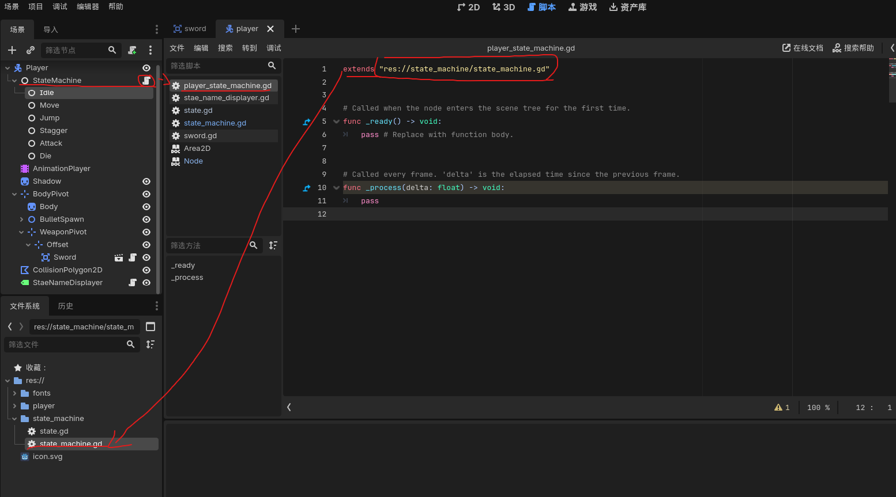  

## 概述：节点结构
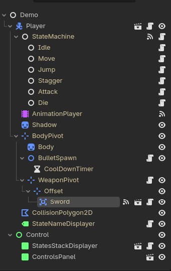

## 一、基础构建
### 1. 武器场景 sword
根节点使用Area2D 设置碰撞mesh 【layer与mesh】  
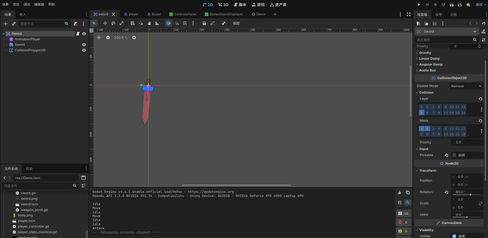  
使用sprite2D作为武器贴图，并使用多边形CollisionObject2D 绘制碰撞区域  
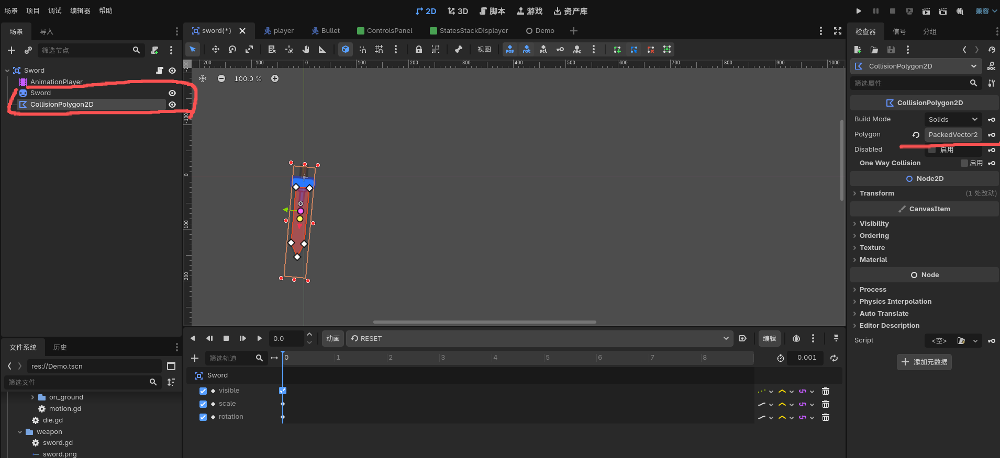 
使用animationplayer 制作武器攻击动画
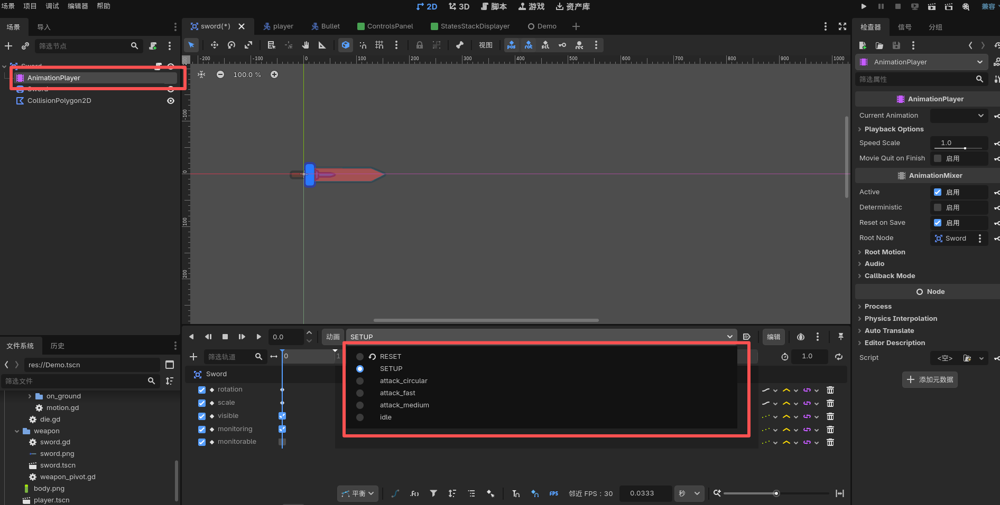  
脚本控制攻击状态与播放攻击动画  
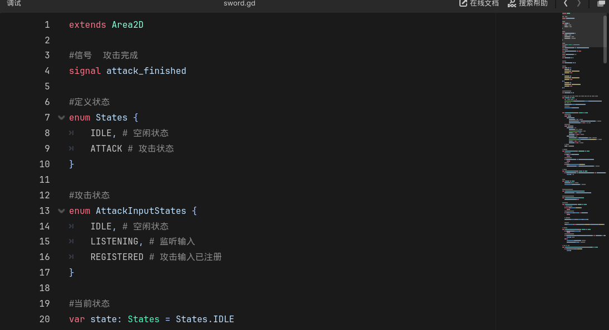

### 2. 子弹场景 bullet
内容已在4.2中详细说明

### 3. Player 场景详解
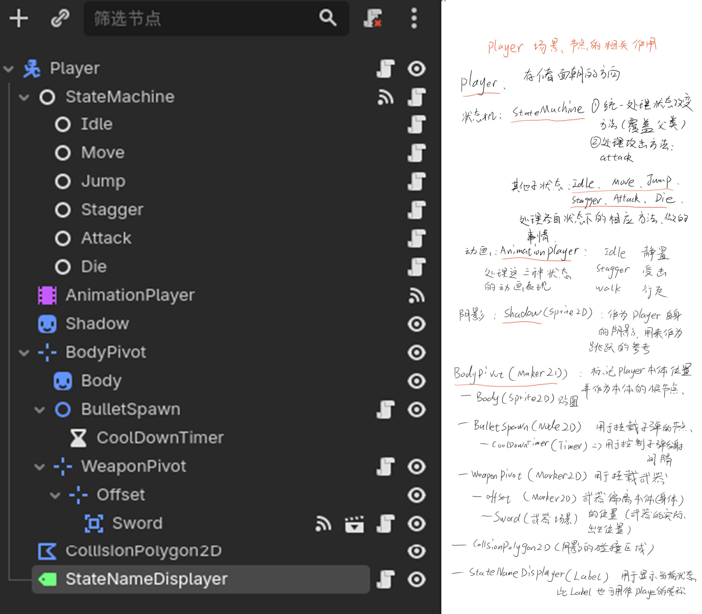
player 代码结构中的继承关系
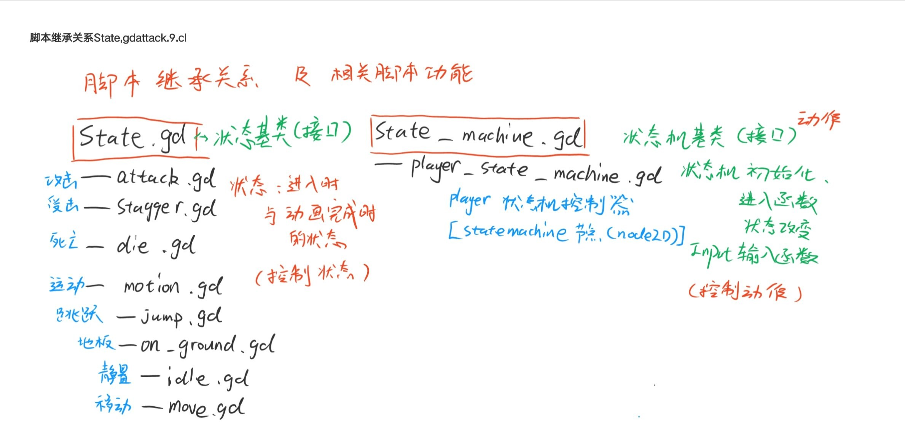
  
状态机基础框架构成  
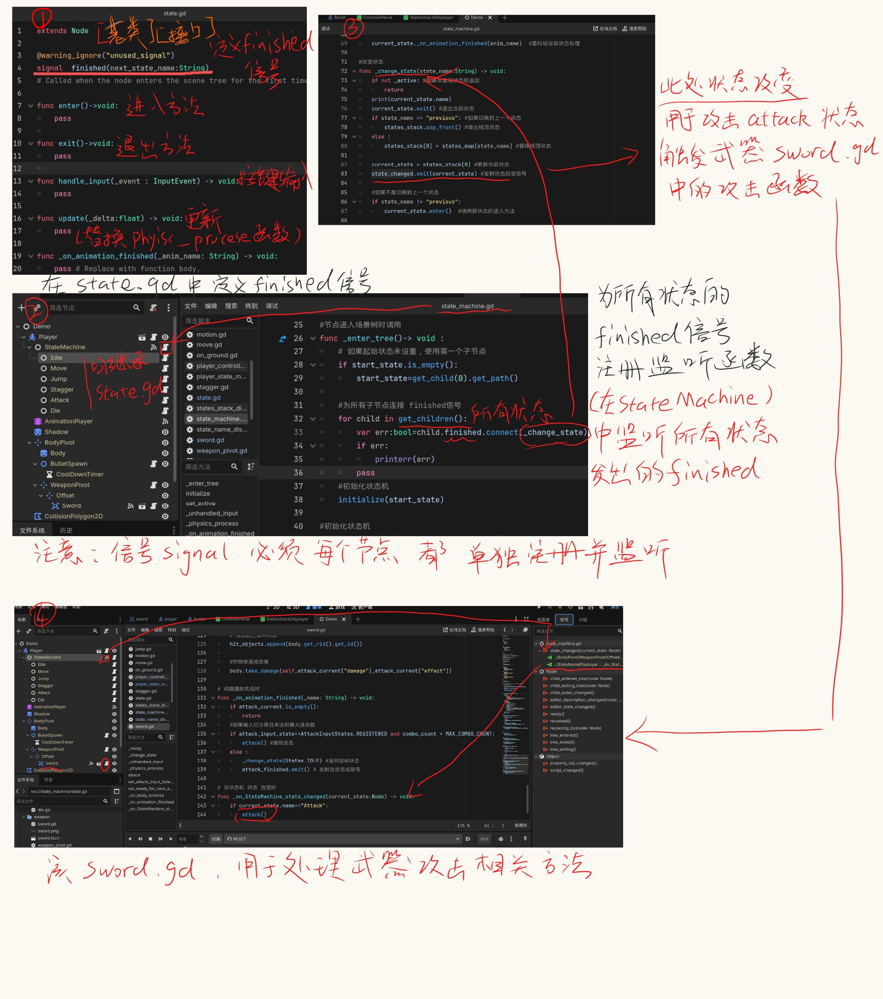  

状态机流转图  
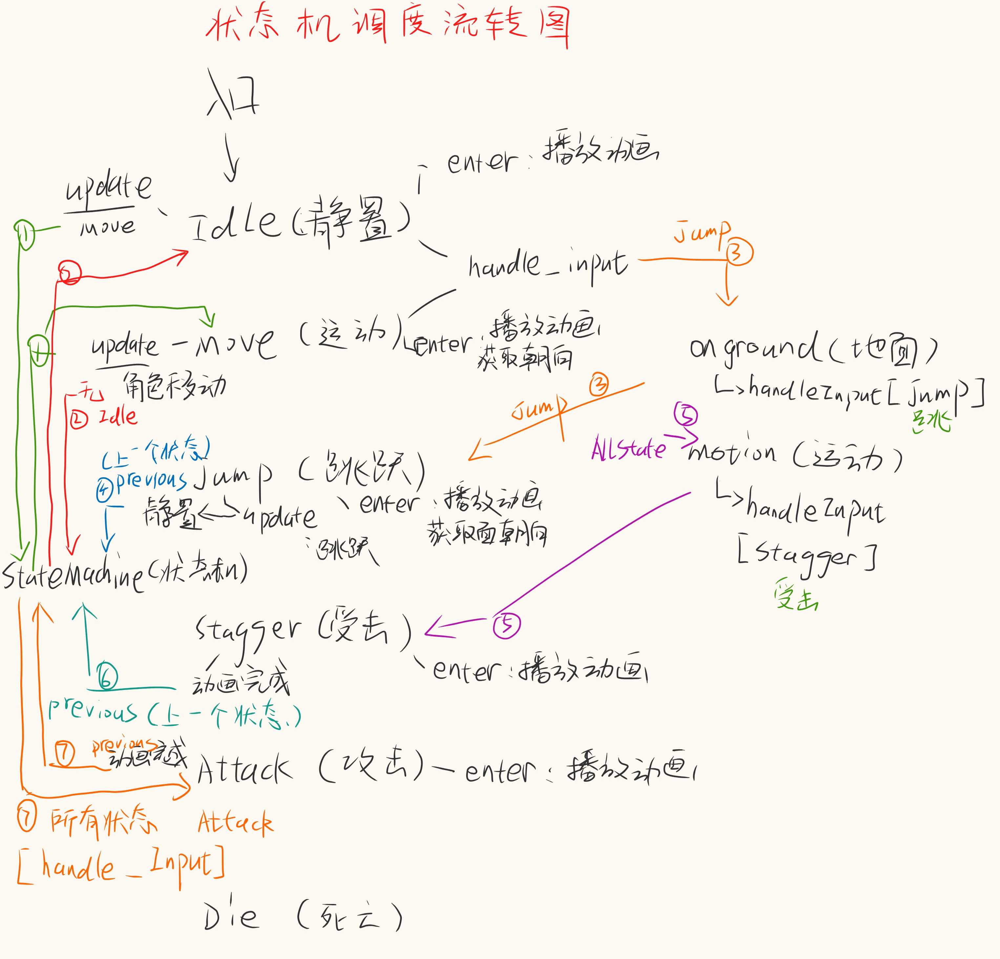  