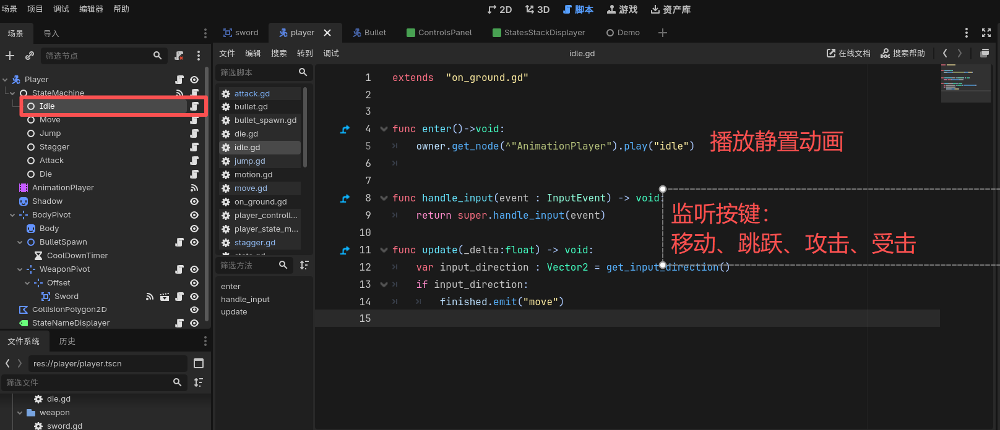
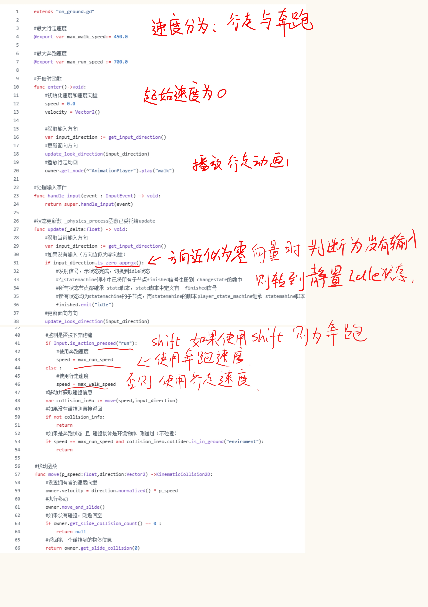
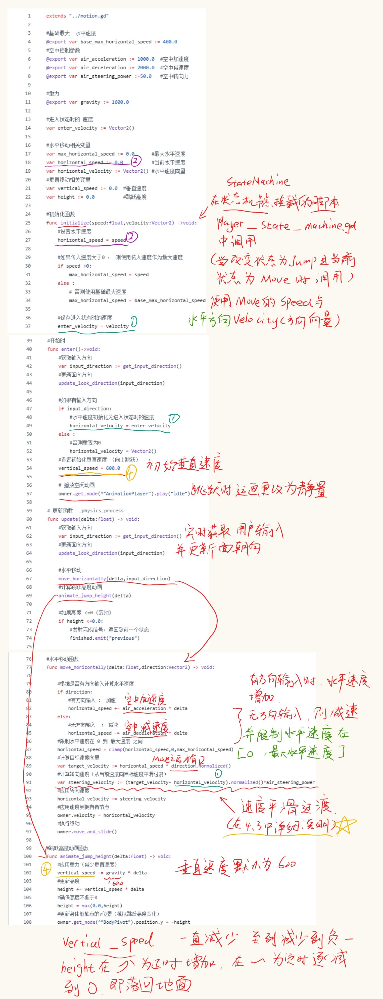
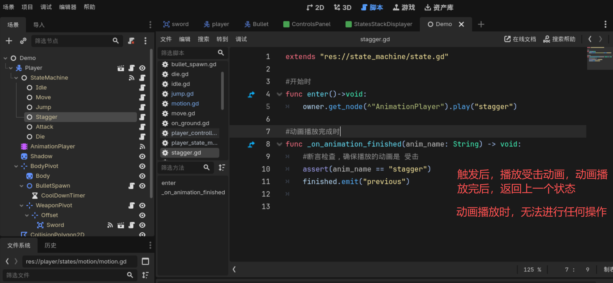
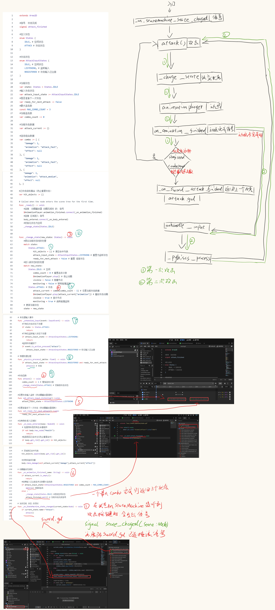

# finite state machine 持久状态机
  
## 0、项目中的一些通用方法
#### 改变轴心点
快捷键是V   
但是有些节点无法改变轴心点（因为它只是一个空的，作为挂载节点，比如Area2D）  
  
所以，可以通过移动 子节点  的方式，来改变旋转的轴心点  
  

#### 使用其他脚本（未在节点中挂载）
使用 extend "路径/xxx.gd" 来拓展其他脚本  
类似于C# 的继承
  

## 概述：节点结构

## 一、基础构建
### 1. 武器场景 sword
根节点使用Area2D 设置碰撞mesh 【layer与mesh】  
  
使用sprite2D作为武器贴图，并使用多边形CollisionObject2D 绘制碰撞区域  
 
使用animationplayer 制作武器攻击动画
  
脚本控制攻击状态与播放攻击动画  

### 2. 子弹场景 bullet
内容已在4.2中详细说明

### 3. Player 场景详解

player 代码结构中的继承关系

  
## 二、状态机
### 1. 基础框架构成  
  

### 2.状态机流转图  
  

### 3.具体状态实现
#### 3-1.静置状态 IDLE
静置状态Idle : 无操作，用来监听其他操作并改变状态  
  

#### 3-2.移动状态 MOVE
移动状态Move : 分为奔跑和行走两种，按下shift时为奔跑
  

#### 3-3.跳跃状态 JUMP
跳跃状态时，角色的移动分为垂直和水平两个方向  
**水平方向**根据Move状态的移动方向和速度平滑过渡  
**垂直方向**会一直减去重力，高度先升高再下降，最终落地
  

#### 3-4.受击状态 Stagger
受击状态在 静置、移动、跳跃 时 可以触发
  

#### 3-5.攻击状态 Attack
攻击状态触发后 会 有 快速攻击 与 重击 动画与伤害均不同
  
